# Hw1 圖解導覽

這份是給剛接手 Hw1 的人看的。先不用急著看每一行程式，照著下面這些圖走，會比較快知道按鈕按下去之後，資料從哪裡來、跑過哪些 OpenCV / PyTorch API、最後又顯示到哪裡。

## 先看整體

Hw1 是一個 PyQt5 GUI。`main.py` 負責視窗、載檔、接按鈕；`question1.py` 到 `question5.py` 才是真正做事的地方。`train.py` 是離線訓練腳本，不是 GUI 啟動時會自動跑的東西。

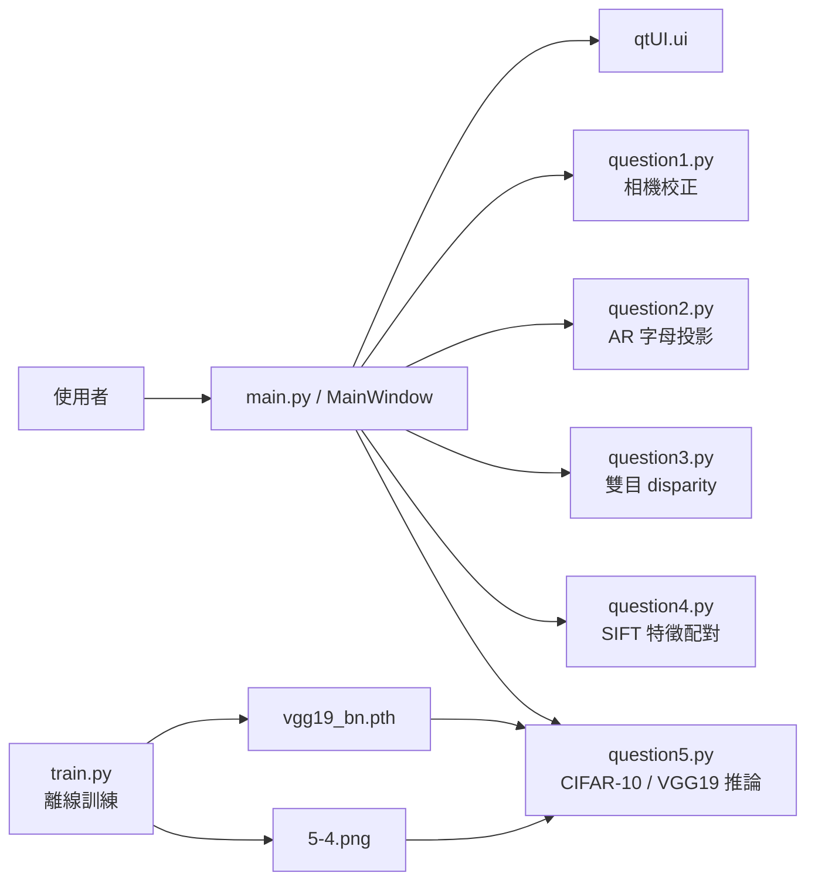

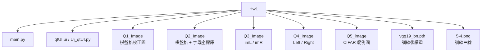

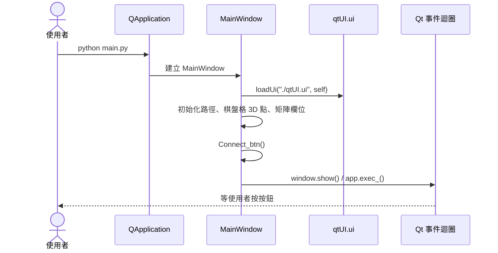

## GUI 訊號怎麼接

這張圖很重要。Hw1 不是每個按鈕都自己算，它大多只是把事件轉去對應的 question 函式。

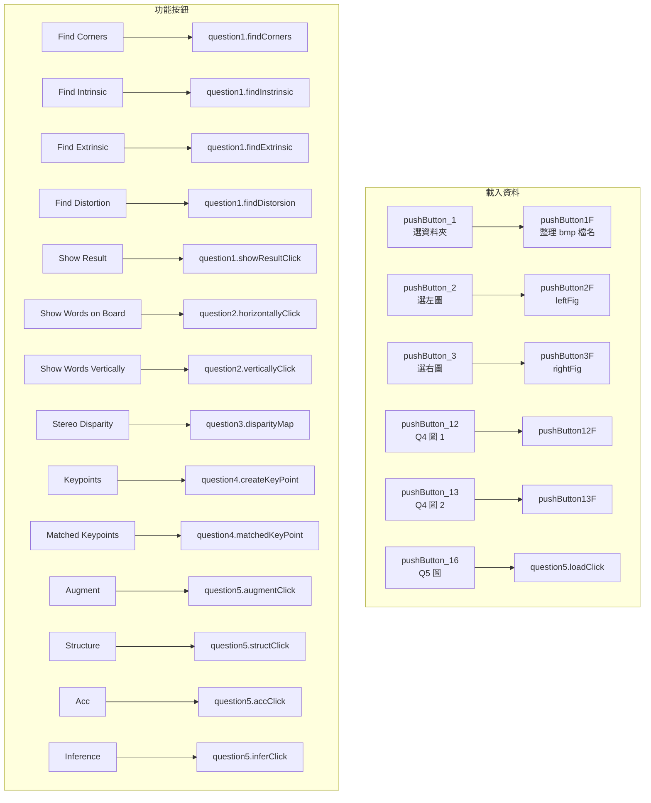

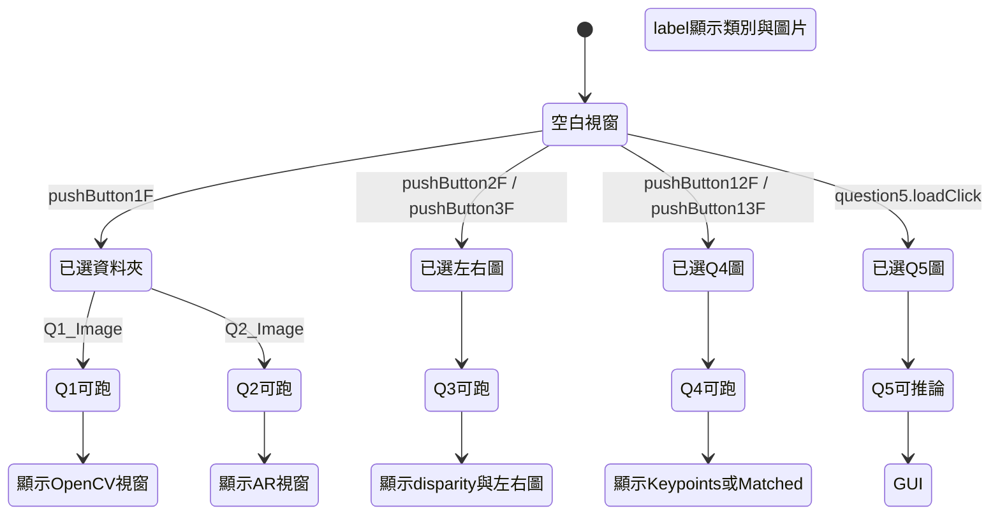

## Q1 相機校正

Q1 的核心是「棋盤格角點」。`main.py` 在初始化時先建立 11 x 8 的世界座標點，之後每張圖都找 2D 角點，再拿 3D / 2D 配對去做 `cv2.calibrateCamera()`。

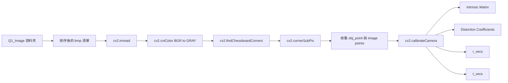

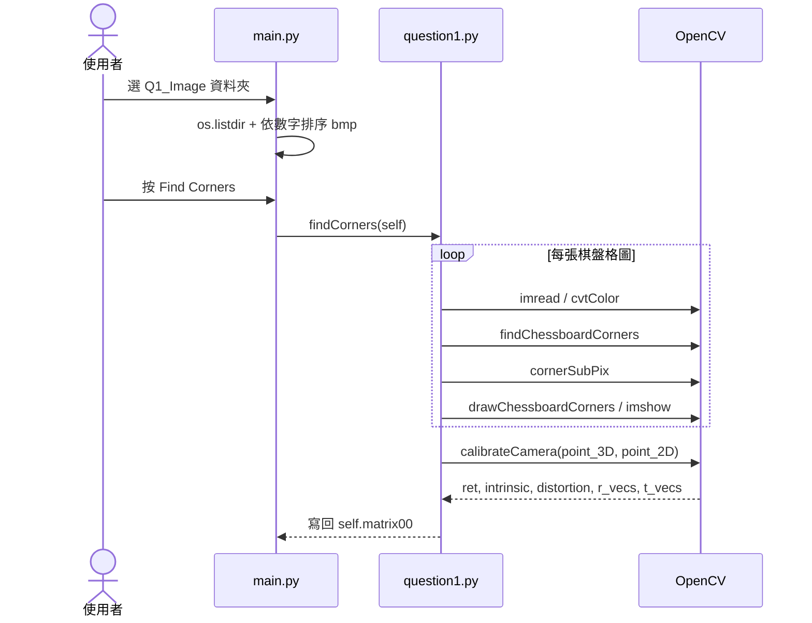

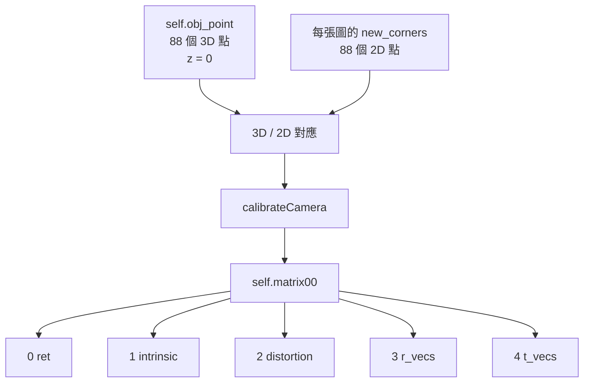

```mermaid
flowchart LR
    Combo[find_extrinsic_combobox<br/>第幾張圖] --> Index[i = int(text) - 1]
    Index --> Rvec["self.matrix00[3][i]"]
    Rvec --> Rodrigues[cv2.Rodrigues]
    Rodrigues --> R[3 x 3 rotation matrix]
    Index --> Tvec["self.matrix00[4][i]"]
    R --> Stack[np.hstack]
    Tvec --> Stack
    Stack --> Extrinsic[3 x 4 extrinsic matrix]
```

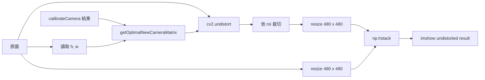

## Q2 AR 字母投影

Q2 其實是 Q1 校正結果的延伸。先重新校正得到相機矩陣，讀文字的 3D 線段座標，再用 `cv2.projectPoints()` 把 3D 線段投到每張棋盤格上。

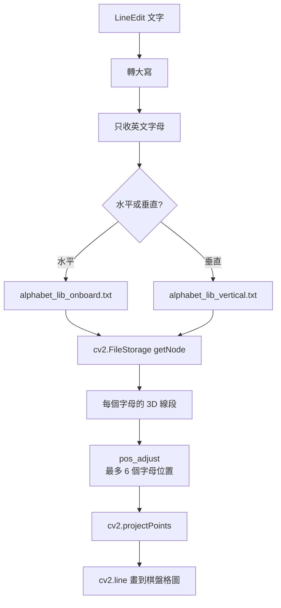

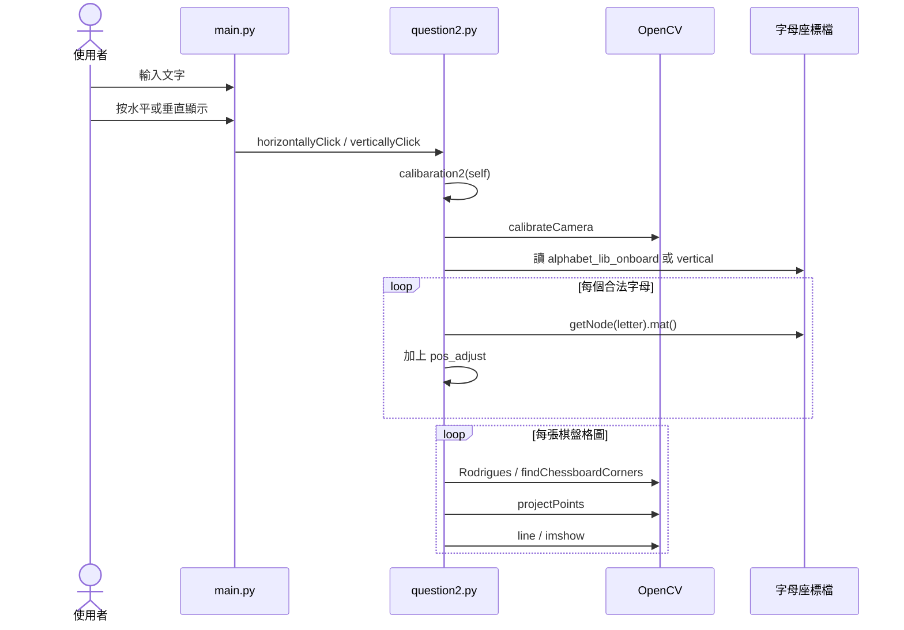

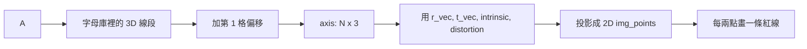

## Q3 雙目 Disparity 和深度

Q3 要先選左圖與右圖。程式用 StereoBM 算 disparity，使用者在左圖點一下時，拿該點的 disparity 去估深度，並在右圖畫出對應位置。

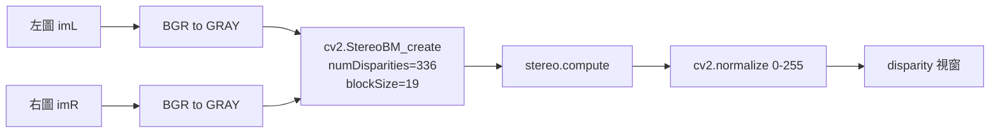

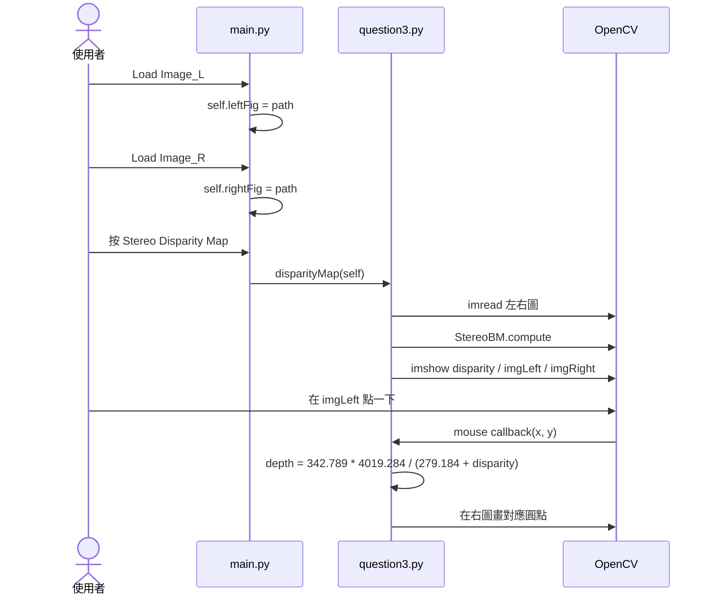

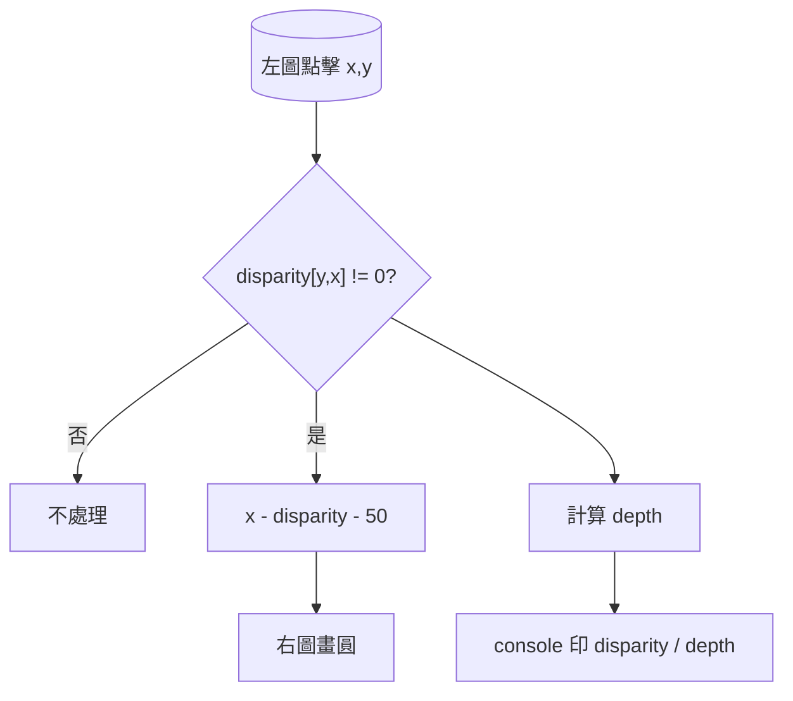

## Q4 SIFT 特徵與配對

Q4 分兩段：先只看單張圖的 keypoints；再看兩張圖的配對。真正篩掉爛配對的是 ratio test，然後用 RANSAC 找 homography 的 mask。

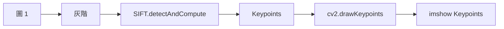

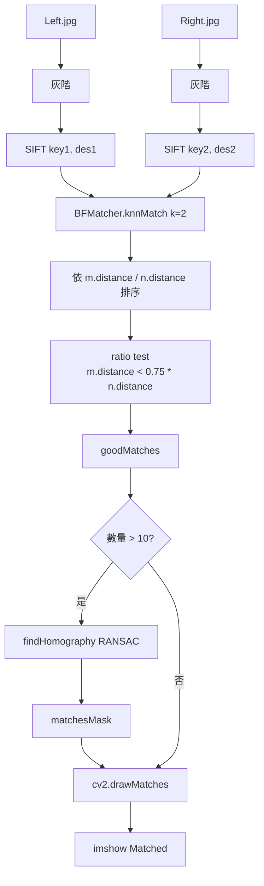

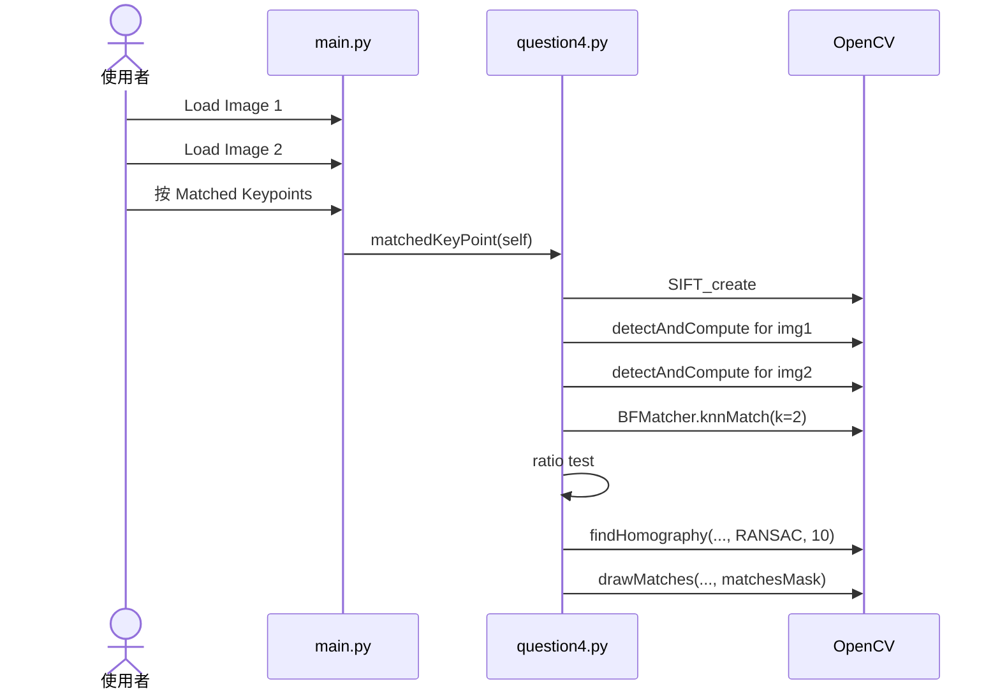

## Q5 CIFAR-10 / VGG19

Q5 有兩條線：`train.py` 先把 CIFAR-10 訓練成 `vgg19_bn.pth`，GUI 的 `question5.inferClick()` 再載入這個權重做推論。也就是說，按 GUI 不會訓練模型，只會使用已經訓練好的檔案。

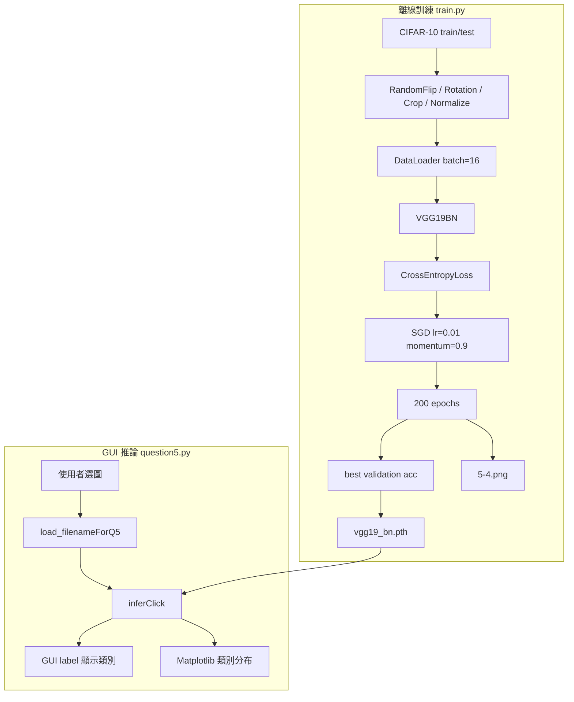

```mermaid
flowchart LR
    Img[Q5 單張圖片] --> T1[RandomHorizontalFlip]
    T1 --> T2[RandomRotation 10]
    T2 --> T3[RandomCrop 32 padding 4]
    T3 --> T4[ToTensor]
    T4 --> T5[Normalize CIFAR mean/std]
    T5 --> Batch[unsqueeze batch 維度]
    Batch --> Model[VGG19BN]
    Model --> Softmax[softmax 10 類]
    Softmax --> Argmax[最大值類別]
```

```mermaid
flowchart TB
    VGG[VGG19BN] --> Base[torchvision.models.vgg19_bn<br/>features]
    Base --> Flat[view batch x 512]
    Flat --> FC1[Linear 512 to 128]
    FC1 --> ReLU[ReLU]
    ReLU --> BN[BatchNorm1d 128]
    BN --> Drop[Dropout]
    Drop --> FC2[Linear 128 to 10]
    FC2 --> Logits[10 類 logits]
```

```mermaid
sequenceDiagram
    actor User as 使用者
    participant GUI as main.py
    participant Q5 as question5.py
    participant Torch as PyTorch
    participant MPL as Matplotlib

    User->>GUI: Load Image
    GUI->>Q5: loadClick(self)
    Q5-->>GUI: self.load_filenameForQ5
    User->>GUI: 按 Inference
    GUI->>Q5: inferClick(self)
    Q5->>Torch: 建立 VGG19BN
    Q5->>Torch: torch.load("vgg19_bn.pth")
    Q5->>Torch: model.eval()
    Q5->>Torch: forward(image)
    Torch-->>Q5: logits
    Q5->>GUI: label 顯示 Predicted
    Q5->>MPL: bar 顯示 10 類機率
```

```mermaid
flowchart TB
    Folder[Q5_image/Q5_1 或 Q5_4] --> PNG[讀 png 檔清單]
    PNG --> Grid[3 x 3 subplot]
    Grid --> Each[逐張 Image.open]
    Each --> KerasAug[Keras RandomFlip / RandomRotation / Rescaling]
    KerasAug --> Show[plt.show 增強後圖片]
```

## API 呼叫圖

這張可以拿來快速查「某題到底靠哪個外部 API」。

```mermaid
flowchart TB
    Hw1[Hw1] --> PyQt[PyQt5<br/>QApplication / QMainWindow / QFileDialog / loadUi]
    Hw1 --> OpenCV[OpenCV]
    Hw1 --> Torch[PyTorch / Torchvision]
    Hw1 --> MPL[Matplotlib]
    Hw1 --> Keras[Keras augmentation]

    OpenCV --> C1[findChessboardCorners / cornerSubPix / calibrateCamera]
    OpenCV --> C2[projectPoints / Rodrigues]
    OpenCV --> C3[StereoBM_create / normalize / setMouseCallback]
    OpenCV --> C4[SIFT_create / BFMatcher / findHomography]
    OpenCV --> C5[imshow / waitKey / destroyAllWindows]

    Torch --> T1[torchvision.datasets.CIFAR10]
    Torch --> T2[torchvision.models.vgg19_bn]
    Torch --> T3[DataLoader / CrossEntropyLoss / SGD]
    Torch --> T4[torch.save / torch.load]
```

## 題目之間的依賴關係

Q1 和 Q2 都吃棋盤格，而且 Q2 其實也要做一次校正；Q3/Q4/Q5 幾乎是各自獨立。

```mermaid
flowchart LR
    Chess[棋盤格影像] --> Q1[Q1 校正]
    Chess --> Q2[Q2 AR 投影]
    Alpha[字母座標庫] --> Q2
    Stereo[左右影像] --> Q3[Q3 disparity]
    Pair[兩張一般影像] --> Q4[Q4 SIFT]
    CIFAR[CIFAR-10 / 範例圖] --> Q5[Q5 VGG19]
    Train[train.py] --> Q5
```

## 常見問題點

```mermaid
flowchart TB
    A[按功能前沒先載檔] --> B[路徑欄位是空字串]
    B --> C[函式直接 return 或 cv2.imread 失敗]
    D[缺 vgg19_bn.pth] --> E[Q5 inference torch.load 失敗]
    F[OpenCV 視窗沒關] --> G[waitKey 阻塞 GUI 體感]
    H[Q2 字太長] --> I[pos_adjust 只準備 6 個位置]
    J[沒裝 opencv-contrib] --> K[SIFT_create 可能不能用]
```

## Hw1 模組閱讀順序

這段整理各模組的依賴與資料流，方便快速掌握專案架構。

```mermaid
flowchart LR
    M1[GUI 架構] --> M2[Q1 校正資料流]
    M2 --> M3[Q2/Q3 幾何結果視覺化]
    M3 --> M4[Q4 特徵配對與篩選]
    M4 --> M5[Q5 訓練產物與 GUI 推論]
```

整理如下：

1. `main.py` 是 GUI 入口，真正的工作分給 `question1` 到 `question5`；`train.py` 是另一條離線訓練線。
2. Q1 的資料流是棋盤格影像進來，找 2D 角點，搭配固定的 3D 棋盤座標，最後得到 intrinsic、distortion、r_vecs、t_vecs。
3. Q2/Q3 分別把校正結果拿來做投影，並從左右圖的 disparity 估深度，本質上都是座標轉換。
4. Q4 先取 SIFT 特徵，再用 BFMatcher 找候選，ratio test 篩一次，RANSAC 再篩一次。
5. Q5 的離線訓練會產生 `vgg19_bn.pth` 和 `5-4.png`，GUI 只負責載權重、做 transform、跑 forward、顯示結果。

整體來看，Hw1 是一個用 PyQt5 把五個小型 Computer Vision / Deep Learning demo 串起來的專案；主程式管互動，各題模組管演算法，深度學習的權重則由訓練腳本先準備好。
