# Hw2 圖解導覽

Hw2 跟 Hw1 一樣是 PyQt5 GUI，但題型更分成兩類：Q1-Q3 是傳統影像處理，直接讀影片或圖片後即時算；Q4-Q5 是深度學習，先離線訓練產生 `.pth` 和圖，再由 GUI 顯示或推論。

## 先看整體

`main2.py` 是入口。它直接包了 Q4/Q5 的模型類別與 GUI 邏輯，另外把 Q1-Q3 放在 `cvdl2_Q1toQ3.py`。訓練腳本則是平常先跑好，GUI 使用訓練完的檔案。

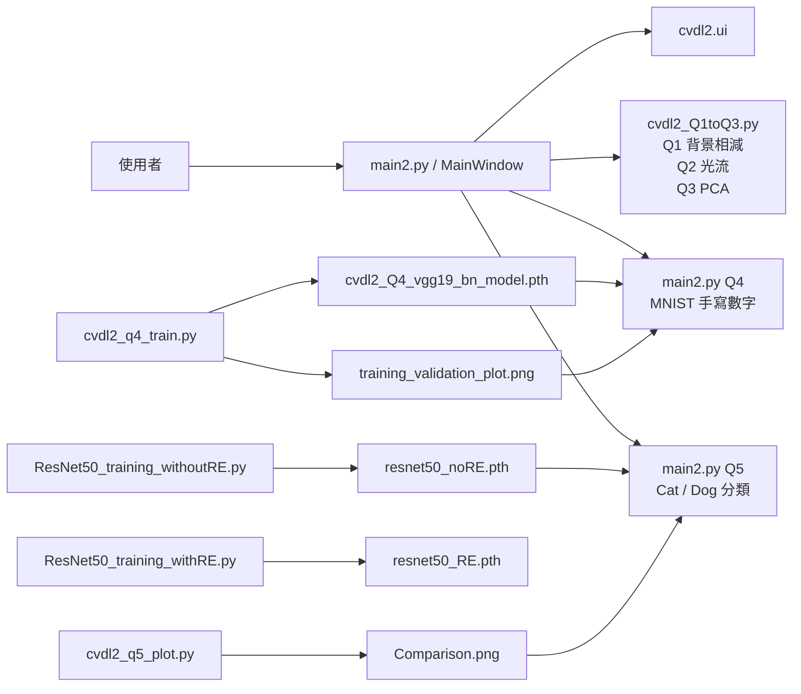

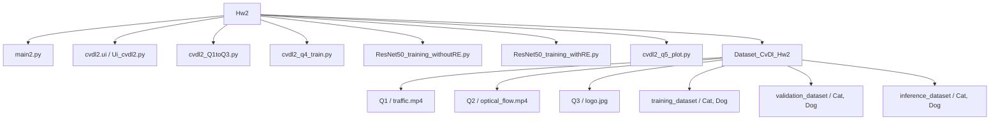

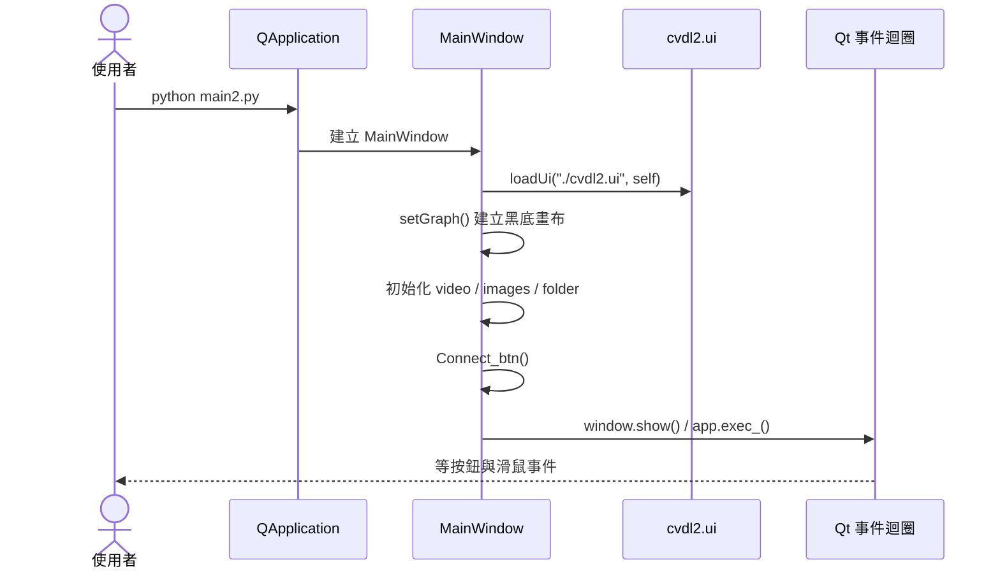

## GUI 訊號怎麼接

Q4 的手寫數字是畫在 `label_1` 上，不是從檔案載入；Q5 的貓狗圖片才是用 `Load Img` 選圖。

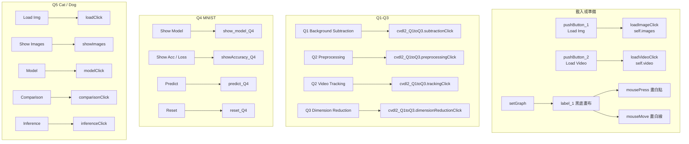

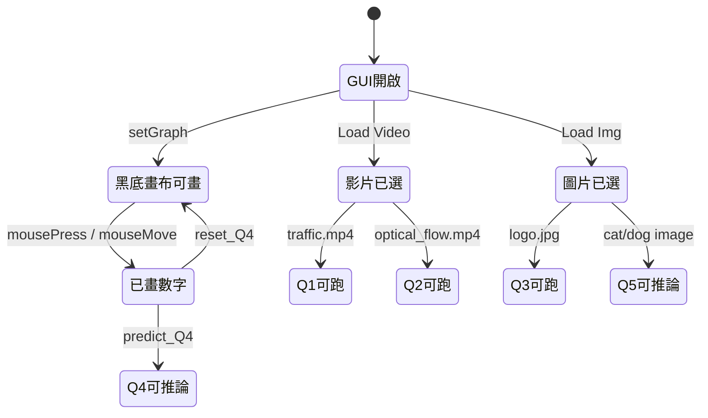

## Q1 背景相減

Q1 讀影片逐幀處理。流程很直：讀 frame、模糊、KNN 背景相減、用 mask 把移動物件留下來。

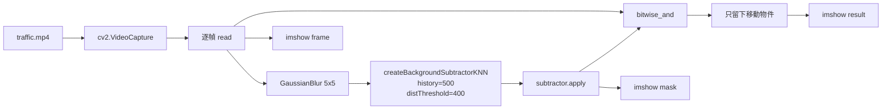

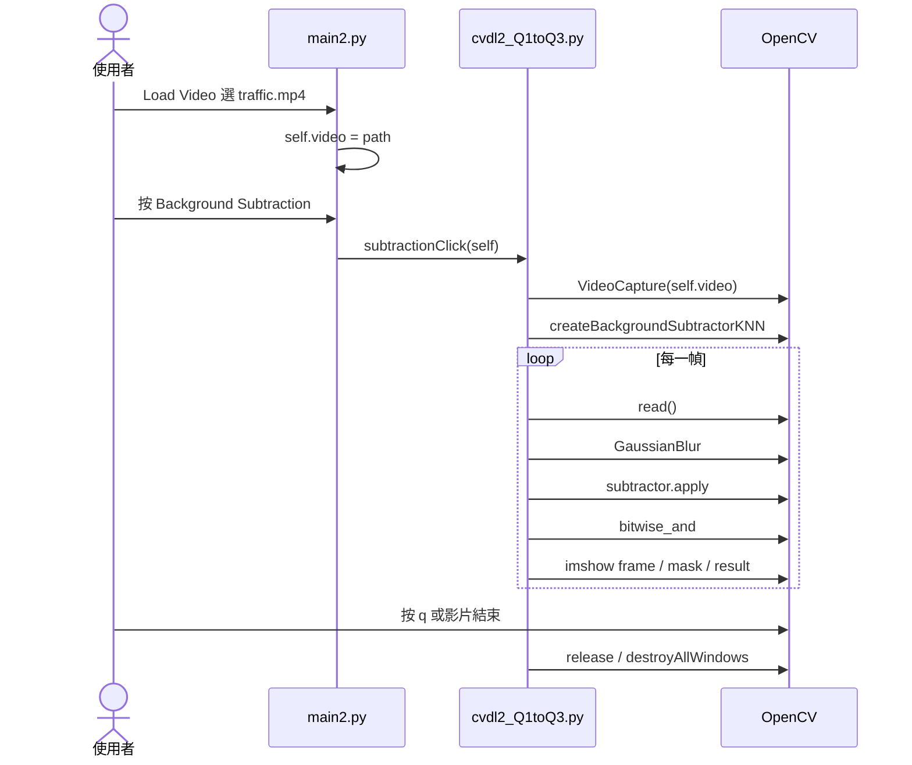

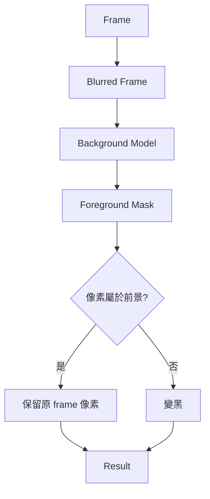

## Q2 Optical Flow

Q2 分成兩個按鈕。Preprocessing 只找第一幀的一個角點；Video tracking 才是真的用 Lucas-Kanade 光流一路追下去。

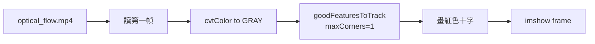

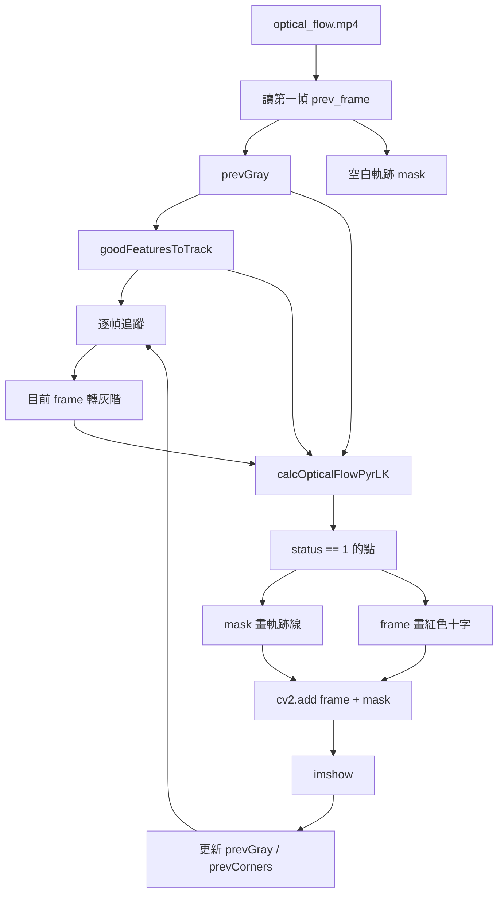

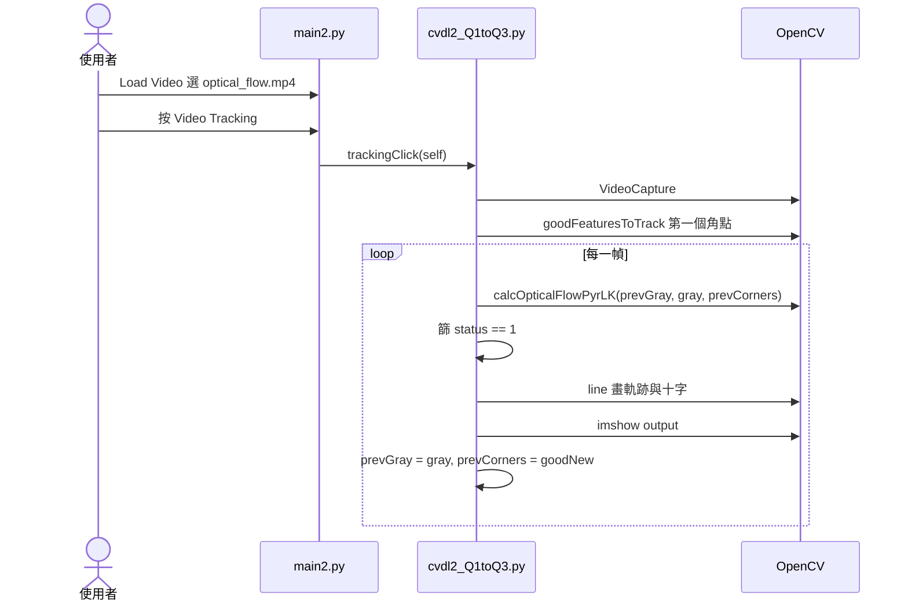

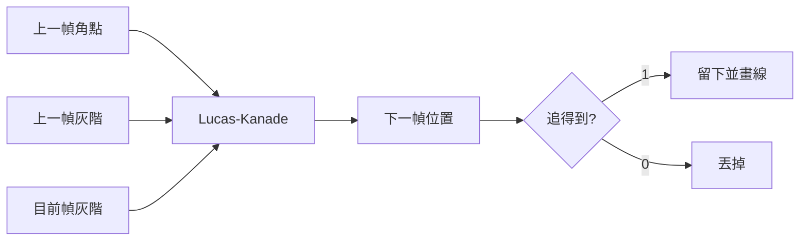

## Q3 PCA Dimension Reduction

Q3 讀單張圖片，轉灰階與 normalize，接著從 `n_components = 1` 開始試 PCA。只要重建 MSE 小於 0.1，或 n 已經到圖片最短邊，就停止。

```mermaid
flowchart LR
    Img[logo.jpg] --> Read[cv2.imread]
    Read --> Gray[cvtColor to GRAY]
    Gray --> Norm[gray / 255.0]
    Norm --> Loop[n = 1 開始]
    Loop --> PCA[PCA(n_components=n)]
    PCA --> Fit[fit_transform]
    Fit --> Inv[inverse_transform]
    Inv --> MSE[計算 reconstruction MSE]
    MSE --> Stop{"MSE <= 0.1<br/>或 n >= min_dim?"}
    Stop -->|否| Inc[n += 1]
    Inc --> Loop
    Stop -->|是| Show[顯示原灰階與重建圖]
```

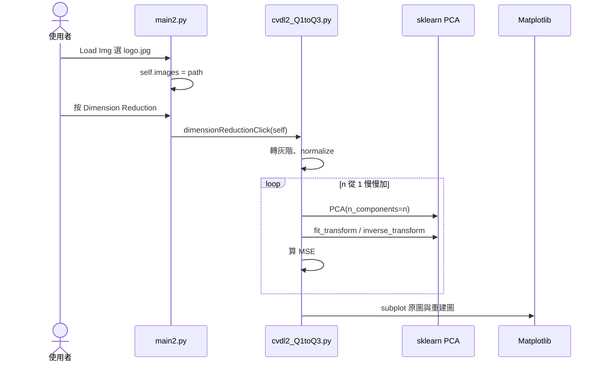

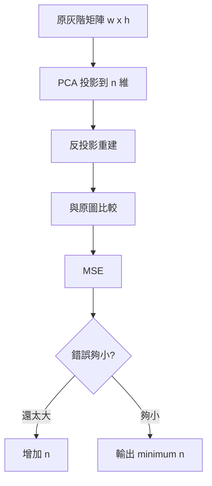

## Q4 MNIST VGG19-BN

Q4 的 GUI 有一塊黑底畫布。使用者用滑鼠畫白色數字，按 predict 後存成 `q4_test.jpg`，再轉成 32 x 32 灰階 tensor，送進訓練好的 VGG19-BN。

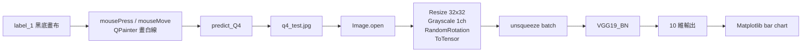

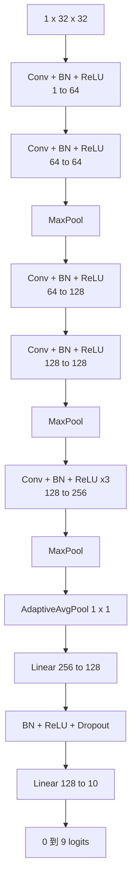

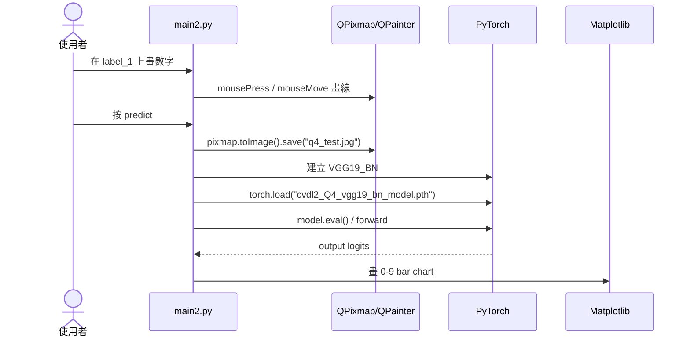

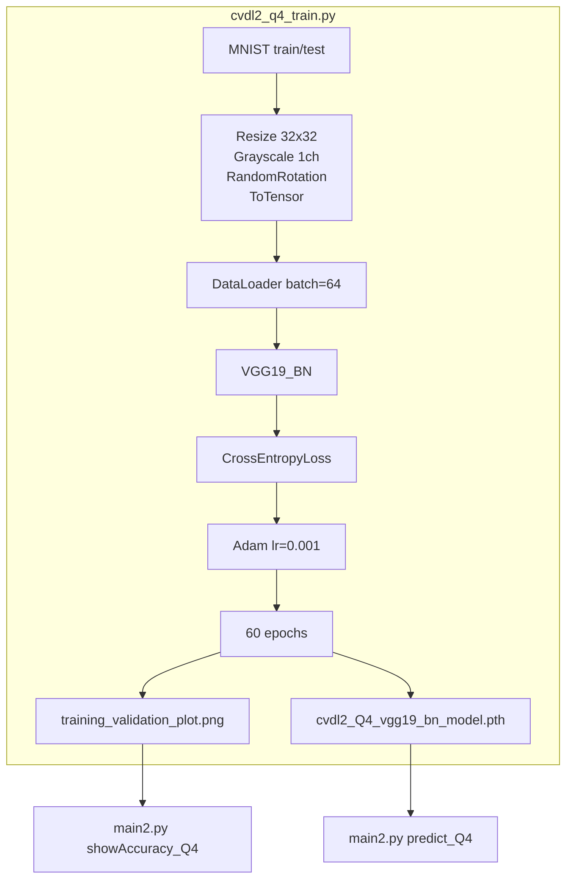

```mermaid
flowchart LR
    PlotFile[training_validation_plot.png] --> PIL[Image.open]
    PIL --> Numpy[np.array]
    Numpy --> RGB[cv2.cvtColor]
    PlotFile --> QImage[QImage(file)]
    QImage --> QPixmap[QPixmap scaled 520 x 240]
    QPixmap --> Label[label_1.setPixmap]
```

## Q5 ResNet50 Cat / Dog

Q5 是二分類。訓練時把資料夾名稱排序後變成 label，通常 `Cat = 0`、`Dog = 1`。模型輸出一個 sigmoid 值，大於 0.5 當 Dog，不然當 Cat。

```mermaid
flowchart TB
    Dataset[Dataset_CvDl_Hw2] --> Train[training_dataset/Cat, Dog]
    Dataset --> Val[validation_dataset/Cat, Dog]
    Dataset --> Infer[inference_dataset/Cat, Dog]
    Train --> LoaderTrain[CustomImageLoader]
    Val --> LoaderVal[CustomImageLoader]
    LoaderTrain --> Transform[RandomResizedCrop 224<br/>RandomHorizontalFlip<br/>RandomRotation<br/>ToTensor]
    LoaderVal --> Transform
    Transform --> ResNet[ResNet50BinaryClassifier]
    ResNet --> BCE[BCELoss]
    BCE --> Adam[Adam lr=0.001]
    Adam --> PTH[resnet50_noRE.pth]
```

```mermaid
flowchart TB
    Input[3 x 224 x 224] --> Backbone[pretrained ResNet50<br/>移除最後 fc]
    Backbone --> Feature[2048 維特徵]
    Feature --> Flat[Flatten]
    Flat --> FC[Linear 2048 to 1]
    FC --> Sigmoid[Sigmoid]
    Sigmoid --> Score[Cat / Dog 分數]
```

```mermaid
flowchart LR
    Img[使用者選的貓狗圖] --> PIL[Image.open RGB]
    PIL --> T1[RandomResizedCrop 224]
    T1 --> T2[RandomHorizontalFlip]
    T2 --> T3[RandomRotation 10]
    T3 --> T4[ToTensor]
    T4 --> Batch[unsqueeze + device]
    Batch --> Model[ResNet50BinaryClassifier]
    Model --> Load[load_state_dict resnet50_noRE.pth]
    Load --> Out[Sigmoid output]
    Out --> Rule{"output > 0.5?"}
    Rule -->|是| Dog[Predict: Dog]
    Rule -->|否| Cat[Predict: Cat]
```

```mermaid
sequenceDiagram
    actor User as 使用者
    participant GUI as main2.py
    participant Torch as PyTorch
    participant Qt as QLabel/QPixmap

    User->>GUI: Q5 Load Img
    GUI->>GUI: self.images = path
    User->>GUI: 按 Inference
    GUI->>Torch: Image.open + transforms
    GUI->>Torch: 建立 ResNet50BinaryClassifier
    GUI->>Torch: torch.load("./resnet50_noRE.pth")
    GUI->>Torch: model.eval() / forward
    Torch-->>GUI: sigmoid output
    GUI->>GUI: output > 0.5 判斷 Cat/Dog
    GUI->>Qt: label_3.setText
    GUI->>Qt: label_2.setPixmap
```

```mermaid
flowchart TB
    subgraph NoRE[without Random Erasing]
        A1[RandomResizedCrop] --> A2[HorizontalFlip]
        A2 --> A3[Rotation]
        A3 --> A4[ToTensor]
        A4 --> A5[訓練 ResNet50]
        A5 --> A6[resnet50_noRE.pth]
    end
    subgraph WithRE[with Random Erasing]
        B1[RandomResizedCrop] --> B2[HorizontalFlip]
        B2 --> B3[Rotation]
        B3 --> B4[ToTensor]
        B4 --> B5[RandomErasing]
        B5 --> B6[訓練 ResNet50]
        B6 --> B7[resnet50_RE.pth<br/>含 metadata 與 model_state_dict]
    end
    A6 --> Compare[cvdl2_q5_plot.py<br/>Comparison.png]
    B7 --> Compare
```

```mermaid
flowchart LR
    Folder[使用者選資料夾] --> Cat[讀 Cat 第一張]
    Folder --> Dog[讀 Dog 第一張]
    Cat --> ResizeC[resize 224 x 224]
    Dog --> ResizeD[resize 224 x 224]
    ResizeC --> RGBc[BGR to RGB]
    ResizeD --> RGBd[BGR to RGB]
    RGBc --> Subplot[Matplotlib 1 x 2]
    RGBd --> Subplot
    Subplot --> Show[顯示 Cat / Dog 範例]
```

```mermaid
flowchart LR
    CompareFile[Comparison.png] --> Read[cv2.imread]
    Read --> Show[cv2.imshow]
    Metrics[with RE 90.7<br/>without RE 90.1] --> CompareFile
```

## 訓練腳本的資料路線

這裡的關鍵是：GUI 不會產生 `.pth`，需要先執行訓練腳本。

```mermaid
flowchart TB
    subgraph Offline[事先執行訓練腳本]
        Q4T[python cvdl2_q4_train.py] --> Q4O1[cvdl2_Q4_vgg19_bn_model.pth]
        Q4T --> Q4O2[training_validation_plot.png]
        Q5T0[python ResNet50_training_withoutRE.py] --> Q5O1[resnet50_noRE.pth]
        Q5T1[python ResNet50_training_withRE.py] --> Q5O2[resnet50_RE.pth]
        Q5P[python cvdl2_q5_plot.py] --> Q5O3[Comparison.png]
    end

    subgraph Runtime[GUI 執行時讀取]
        Q4O1 --> P4[predict_Q4]
        Q4O2 --> A4[showAccuracy_Q4]
        Q5O1 --> P5[inferenceClick]
        Q5O3 --> A5[comparisonClick]
    end
```

## API 呼叫圖

```mermaid
flowchart TB
    Hw2[Hw2] --> PyQt[PyQt5]
    Hw2 --> CV[OpenCV]
    Hw2 --> SK[scikit-learn]
    Hw2 --> Torch[PyTorch / Torchvision]
    Hw2 --> PIL[Pillow]
    Hw2 --> MPL[Matplotlib]

    PyQt --> P1[QApplication / QMainWindow / QFileDialog / loadUi]
    PyQt --> P2[QImage / QPixmap / QPainter / QPen]

    CV --> C1[VideoCapture / imshow / waitKey]
    CV --> C2[createBackgroundSubtractorKNN / bitwise_and]
    CV --> C3[goodFeaturesToTrack / calcOpticalFlowPyrLK]
    CV --> C4[cvtColor / resize / imread]

    SK --> S1[PCA fit_transform / inverse_transform]

    Torch --> T1[MNIST / DataLoader / CrossEntropyLoss / Adam]
    Torch --> T2[models.resnet50 pretrained]
    Torch --> T3[BCELoss / Sigmoid / torch.save / torch.load]
```

## Q1-Q5 一起看

整體分成兩條資料線：前 3 題是影像處理 pipeline，後 2 題是模型 pipeline。

```mermaid
flowchart LR
    subgraph Traditional[傳統影像處理]
        V1[交通影片] --> Q1[背景相減]
        V2[光流影片] --> Q2[角點偵測與追蹤]
        I3[logo 圖] --> Q3[PCA 壓縮重建]
    end

    subgraph DeepLearning[深度學習]
        D4[MNIST] --> T4[訓練 VGG19_BN]
        T4 --> G4[手寫數字 GUI 推論]
        D5[Cat / Dog 資料集] --> T5[訓練 ResNet50]
        T5 --> G5[貓狗 GUI 推論]
    end
```

## 常見卡點

```mermaid
flowchart TB
    A[Q1/Q2 沒先 Load Video] --> B[self.video 空字串]
    B --> C[VideoCapture 讀不到 frame]
    D[Q3 沒先 Load Img] --> E[cv2.imread 失敗]
    F[Q4 沒有 cvdl2_Q4_vgg19_bn_model.pth] --> G[torch.load 失敗]
    H[Q5 沒有 resnet50_noRE.pth] --> I[inferenceClick 失敗]
    J[withRE 權重格式不同] --> K[GUI 目前只直接讀 noRE state_dict]
    L[OpenCV 視窗未關] --> M[waitKey 讓流程看起來卡住]
```

## Hw2 模組閱讀順序

```mermaid
flowchart LR
    M1[專案分層] --> M2[Q1 背景相減]
    M2 --> M3[Q2 光流與 Q3 PCA]
    M3 --> M4[Q4 手寫數字]
    M4 --> M5[Q5 貓狗與訓練產物]
```

整理如下：

1. `main2.py` 是 GUI 入口，Q1-Q3 放在 `cvdl2_Q1toQ3.py`，Q4/Q5 的模型與推論留在 `main2.py`，訓練腳本是另一條線。
2. Q1 的影片 pipeline 會逐幀讀取影像，做模糊和 KNN 背景相減，再把 mask 套回原圖，因此會有 frame、mask、result 三個視窗。
3. Q2/Q3 是傳統 CV 流程；Q2 先找角點再用 Lucas-Kanade 追蹤，Q3 則持續增加 PCA 維度，直到重建誤差夠小。
4. Q4 會把滑鼠畫的圖先存成 `q4_test.jpg`，再 resize 成 MNIST/VGG19-BN 要的格式，載入 `.pth` 後輸出 0 到 9 的分數。
5. Q5 使用 ImageNet 預訓練的 ResNet50 backbone，最後換成 sigmoid 二分類頭；`resnet50_noRE.pth` 給 GUI 推論，`Comparison.png` 保存兩種設定的比較結果。

整體來看，Hw2 是一個把傳統影像處理和兩個深度學習分類 demo 放在同一個 PyQt5 介面裡的專案；Q1-Q3 是即時計算，Q4-Q5 則是先訓練好模型，再讓 GUI 載入權重做展示。
